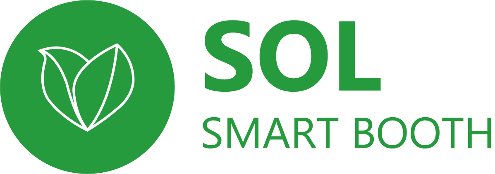
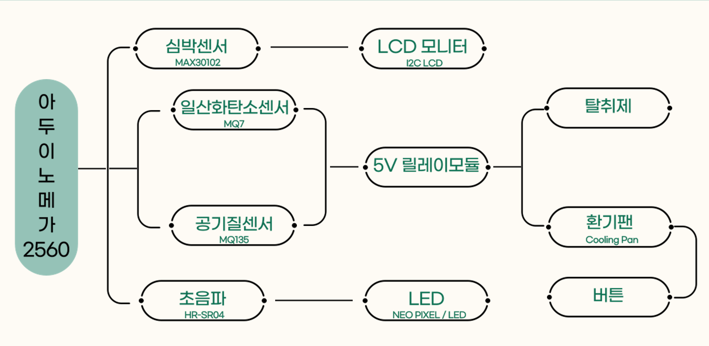
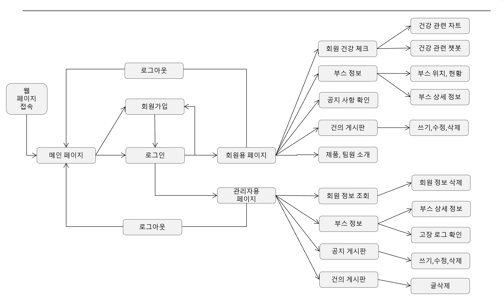
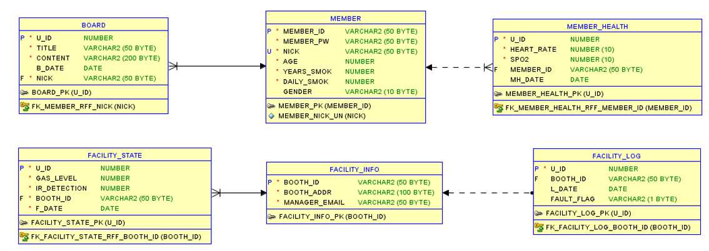

---
 

♦️team_솔의룸

핵심프로젝트

<h3>프로젝트 소개</h3>

아두이노를 기반으로 흡연부스 내부의 기계장치를 제어하고 흡연부스에 설치된 센서(심박수,산소포화도센서,가스센서 등)의 값을 wifi통신을통해 web에서 활용하여 사용자 및 관리자에게 서비스를제공

<h3>사용 스택</h3>

 

   

<h3>개발 목표</h3>

  <table style="border-collapse: collapse;">
    <tr>
      <th style="background-color: gray; border: 1px solid white; padding: 10px;">흡연부스 (H/W)</th>
      <th style="background-color: gray; border: 1px solid white; padding: 10px;">사용자서비스</th>
      <th style="background-color: gray; border: 1px solid white; padding: 10px;">관리자서비스</th>
    </tr>
    <tr>
      <td style="background-color: lightgrey; border: 1px solid white; padding: 10px;">스노우화이트</td>
      <td style="background-color: lightgrey; border: 1px solid white; padding: 10px;">스노우화이트</td>
      <td style="background-color: lightgrey; border: 1px solid white; padding: 10px;">스노우화이트</td>
    </tr>
  </table>

<h3>개발 내용</h3>
 <h4>IoT(H/W) 설계 흐름도</h4>
  

 <h4>서비스 흐름도</h4>
  
 
 <h4>E-R다이어그램</h4>
  
<h3>팀원 소개</h3>

